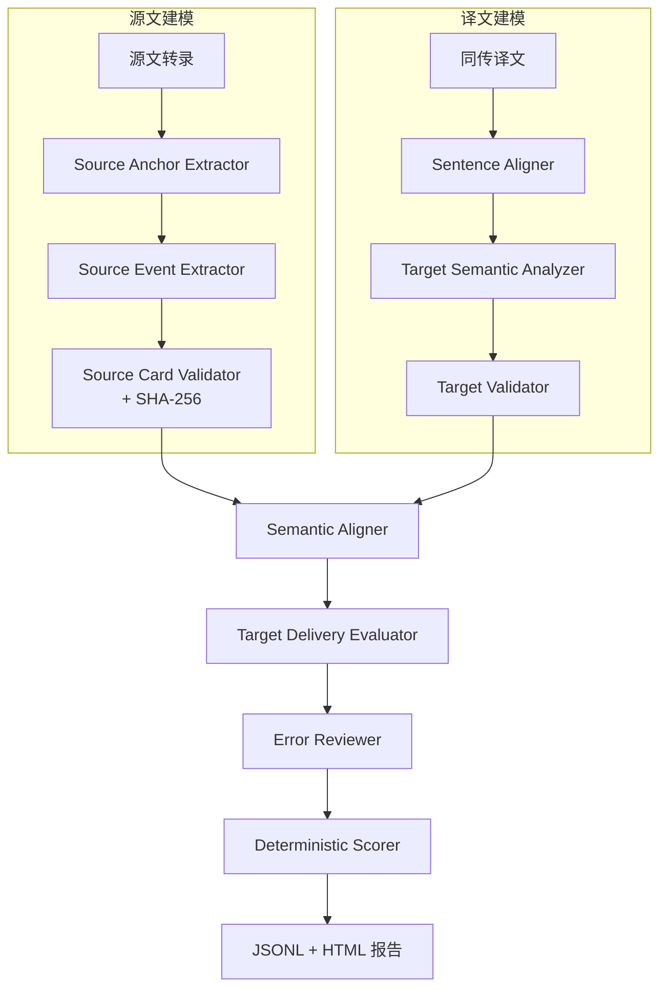

# EviSI-Eval Agent

> 面向同声传译系统最终译文的证据驱动评测 Agent

[](LICENSE)
[](pyproject.toml)
[](CHANGELOG.md)
[](schemas/)

EviSI-Eval 是面向同声传译系统最终译文的**证据驱动**评测 Agent。系统以源语转录为事实依据，将源文和同传译文分别转换为结构化语义表示，再执行显式对齐、局部核验、独立复核和确定性计分。

**核心原则**：大模型不直接生成总分。所有扣分、重复错误抑制、维度汇总和总分封顶都由 Python 按固定协议执行。

## 关键特性

- 🎯 **5 维评分** — 事实锚点 / 事件语义 / 逻辑关系 / 流利度 / 表达效率，按重要性加权
- 🔒 **证据约束** — 源文与译文证据跨度必须逐字存在于对应文本，结构化输出失败时**失败关闭**
- 🚦 **两级对齐** — 先建立源句—译文单元映射（1:1 / 1:N / N:1 / omitted / uncertain），再核验事实与事件
- 🧩 **职责分离** — LLM 只产 verdict，Python 算分；句级对齐与项目级核验分离；目标分析器看不到源文以避免确认偏差
- ⚖️ **确定性聚合** — 所有维度分由 Python 按固定权重、importance 和 verdict 系数计算
- 🔍 **独立复核** — 每个候选错误必须通过复核才能扣分；置信度 < 0.70 进入人工复核队列
- 🛡️ **错误单归因** — 同一语义损失只在一个维度扣分；总分封顶防止局部错误被掩盖

## 评测维度

| 维度 | 权重 | 输入 |
|---|---:|---|
| 事实锚点准确性 | 30 | `anchor_alignments` |
| 事件语义保持 | 40 | `event_alignments` |
| 逻辑关系保持 | 10 | `relation_alignments` |
| 流利度与可理解性 | 12 | `fluency_issues` |
| 表达效率与简洁性 | 8 | `efficiency_issues` |

## 架构图



完整设计见 [系统架构](docs/architecture.md)。

## 快速开始

```powershell
# 1. 克隆仓库
git clone https://github.com/caiqiezujian/EviSI-Eval-Agent.git
cd EviSI-Eval-Agent

# 2. 安装依赖
pip install -e .

# 3. 配置密钥
Copy-Item .\local_secrets.py.example .\local_secrets.py
# 编辑 local_secrets.py 填入 DEEPSEEK_API_KEY

# 4. 验证模型连接
python -m evisi_eval check-provider --provider deepseek

# 5. 跑示例评测
python -m evisi_eval run `
  --samples data/example_samples.jsonl `
  --outputs data/example_outputs.jsonl `
  --provider deepseek `
  --run-name example_run
```

也可以使用根目录入口：

```powershell
python run_evaluation.py --samples data/example_samples.jsonl --outputs data/example_outputs.jsonl --provider deepseek
```

## 输入格式

源文样本 `data/example_samples.jsonl`（每个 `sample_id` 唯一）：

```json
{"sample_id": "s1", "transcript": "The treatment may reduce the risk by 30 percent.", "offline_translation": "这种治疗可能将风险降低百分之三十。", "src_lang": "en", "tgt_lang": "zh", "domain": "medical"}
```

系统输出 `data/example_outputs.jsonl`（每个 `(sample_id, system_name)` 唯一）：

```json
{"sample_id": "s1", "system_name": "system_a", "si_translation": "这种治疗可能将风险降低百分之三十。"}
```

支持 `source_only`（无离线译文）和 `reference_assisted`（含离线译文）两种模式，两种模式使用同一套评测链路。

## 输出结构

```text
results/<run_name>/
├── source_cards.jsonl       # 源文结构化卡片
├── partial_results.jsonl    # 增量结果（断点续跑用）
├── results.jsonl            # 最终评测结果
├── failures.jsonl           # 失败记录
├── metrics.json             # 聚合指标
├── run_manifest.json        # 输入 + Prompt 哈希 + 模型版本
└── report.html              # 可视化报告
```

断点续跑会核对输入文件、Prompt、模型、评分权重和版本哈希，任一项变化都会拒绝复用旧结果。

## 评分公式

每个源项目按重要性（1 / 2 / 3）分配权重：

```text
item_budget    = dimension_weight × item_importance / Σ(dimension_item_importance)
item_deduction = item_budget × verdict_coefficient
dimension_score = dimension_weight - Σ(accepted_item_deduction)
```

Verdict 系数：

| 维度 | verdict | 系数 |
|---|---|---:|
| Anchor | `exact` / `equivalent` | 0 |
| Anchor | `incorrect` / `missing` | 1 |
| Anchor | `ambiguous` | 0（进入复核队列）|
| Event | `covered` / `compressed_covered` | 0 |
| Event | `partially_covered` | 0.5 |
| Event | `contradicted` / `missing` | 1 |
| Relation | `preserved` | 0 |
| Relation | `weakened` | 0.5 |
| Relation | `reversed` / `missing` | 1 |

**总分封顶**：关键事件被反译 → 55 上限；关键事件完全缺失 → 65 上限；关键锚点错误 → 65 上限；关键关系反转 → 60 上限；存在关键不可理解片段 → 60 上限。详见 [评分协议](docs/scoring_protocol.md)。

## 模型配置

支持 DeepSeek / OpenAI / Gemini / OpenAI-compatible 服务。配置可放在环境变量或 `local_secrets.py`（不提交到仓库）：

```python
EVISI_PRIMARY_PROVIDER = "deepseek"
EVISI_REVIEW_PROVIDER = "deepseek"
DEEPSEEK_API_KEY = "your-key"
DEEPSEEK_MODEL = "deepseek-chat"
DEEPSEEK_BASE_URL = "https://api.deepseek.com"
```

## 项目结构

```text
EviSI-Eval-Agent/
├── data/                  # 示例输入与输出
├── docs/                  # 架构、评分、数据契约、运行指南
├── evisi_eval/            # 唯一正式实现
├── prompts/               # 8 个版本化 Prompt 单一来源
├── schemas/               # 4 个 JSON Schema
├── tests/                 # 单元与端到端测试
├── local_secrets.py.example
├── run_evaluation.py      # 顶层入口
├── run_agent.py           # LLM Agent 评测入口
├── pyproject.toml
├── README.md
├── LICENSE
└── CHANGELOG.md
```

## 文档导航

- [系统架构](docs/architecture.md) — 设计原则、数据流、四阶段管线、扩展接口
- [评分协议](docs/scoring_protocol.md) — 维度权重、verdict 系数、错误去重、复核门槛、总分封顶
- [数据契约](docs/data_contract.md) — 样本输入、系统输出、Source Card、Target Analysis、Evaluation Result
- [运行指南](docs/operation_guide.md) — 离线演示、模型配置、断点续跑、报告导出

## 开发验证

```powershell
python -m pytest -q
```

## 当前边界

- Source Card 已执行机器校验，但正式 benchmark 发布前仍建议人工冻结高重要性锚点和事件
- LLM 判定具有模型方差，正式对比实验应固定模型、Prompt 哈希、温度和复核模型
- 五维权重是当前协议值，后续需要使用人工标注集检验相关性并进行版本化校准
- 当前版本不使用各系统自己的 ASR，不推断真实延迟、增量稳定性、修订率或闪烁率——这些指标需要音频、时间戳或增量输出，应作为独立的流式评测轨道接入

## 协议版本

当前协议版本：`evisi_eval_v0.4.1`

所有 Prompt / Schema / 权重变更必须升级协议版本。变更记录见 [CHANGELOG.md](CHANGELOG.md)。

## License

[MIT](LICENSE)