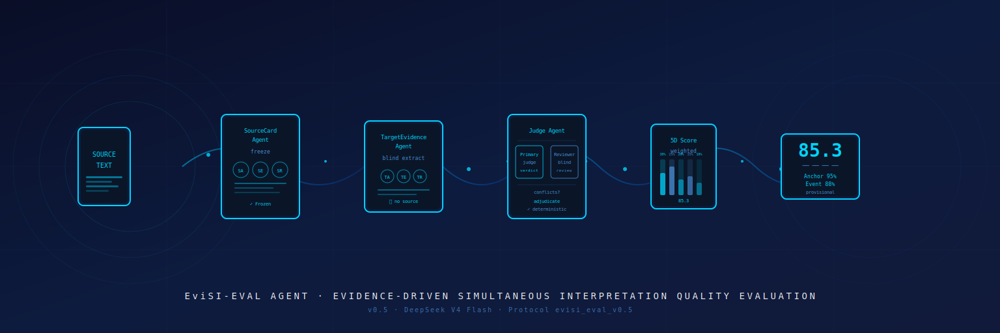

# EviSI-Eval Agent

> **Evidence-driven Simultaneous Interpretation Quality Evaluation System**

[](docs/assets/hero-banner.svg)
[](pyproject.toml)
[](https://www.python.org/downloads/)
[](LICENSE)
[](tests/)
[](https://platform.deepseek.com/)
[](https://github.com/caiqiezujian/EviSI-Eval/stargazers)
[](https://github.com/caiqiezujian/EviSI-Eval/network/members)

<!-- Suppress the raw SVG banner below in text view -->
<picture>
  <source srcset="docs/assets/hero-banner.svg" type="image/svg+xml">
  
</picture>

---

## 评估范围

本项目评估**源语转录对应的最终同传文本**质量。不评估音频质量、ASR、首词延迟、平均滞后、增量字幕稳定性或语音播报质量。

## 核心设计原则

| 原则 | 说明 |
|:---|:---|
| **冻结源卡** | 每个样本的源端分析只构建一次，所有系统共享同一基准，不可篡改 |
| **信息隔离** | 目标证据抽取不看源文，独立复核不看首轮判定，避免诱导偏差 |
| **双 Agent 裁决** | 首轮判定 + 独立盲复核，分歧或低置信度项（< 0.60）进入第三方裁决 |
| **确定性计分** | LLM 只给逐项判定和可定位证据，Python 按公开规则计算分数 |
| **不可伪造 Summary** | Summary Agent 只读总结，不改 verdict 或分数 |

> 在完成人工标注与一致性检验前，不应宣称评分已达绝对客观或成为成熟 benchmark。

## 架构概览

```
┌──────────┐     ┌───────────────────┐     ┌──────────────────┐
│  Source  │────▶│ SourceCardAgent   │     │ Alignment Agent  │
│   Text   │     │   (freeze once)   │     │  (lossless align)│
└──────────┘     └─────────┬─────────┘     └────────┬─────────┘
                           │                         │
                           │                ┌────────▼─────────┐
                           │                │ TargetEvidence   │
                           │                │ Agent (blind)    │
                           │                └────────┬─────────┘
                           │                         │
                           │              ┌──────────┼──────────┐
                           │              │          │          │
                           │         ┌────▼────┐ ┌──▼─────┐ ┌─▼───────┐
                           │         │Fluency  │ │SI Expr │ │ Primary │
                           │         │ Agent   │ │ Agent  │ │  Judge  │
                           │         └─────────┘ └────────┘ └───┬────┘
                           │                                    │
                           │                        ┌───────────▼──────────┐
                           │                        │     Reviewer Agent   │
                           │                        │      (blind)         │
                           │                        └───────────┬──────────┘
                           │                                    │
                           │                         conflict or conf < 0.60?
                           │                                    │
                           │                         ┌──────────┴──────────┐
                           │                         │                     │
                           │                         ▼                     │
                           │               ┌─────────────────┐             │
                           │               │   Adjudicator   │             │
                           │               │     Agent       │             │
                           │               └────────┬────────┘             │
                           │                        │                     │
                           └────────────────────────┴─────────────────────┘
                                              │
                                    ┌─────────▼──────────┐
                                    │   确定性计分        │
                                    │   5维加权评分       │
                                    └─────────┬──────────┘
                                              │
                                    ┌─────────▼──────────┐
                                    │   Summary Agent     │
                                    │   (read-only)       │
                                    └────────────────────┘
```

**9 个 Agent，各司其职：**

| Agent | 职责 | 信息边界 |
|:---|:---|:---|
| `SourceCardAgent` | 源文分段、抽取 anchors/events/relations | **仅源文**，永不看译文 |
| `AlignmentAgent` | 对齐切分，无损归属语义 | 源文 + 译文 |
| `TargetEvidenceAgent` | 目标侧盲抽取 anchors/events/relations | **仅目标译文**，不看源文 |
| `FluencyAgent` | 评估目标语通顺度 | **仅译文** |
| `SIExpressionAgent` | 评估同传表达效率问题 | 源文 + 译文 |
| `JudgeAgent` (Primary) | 首轮逐项 fidelity 判定 | 冻结源卡 + 目标证据卡 |
| `JudgeAgent` (Reviewer) | 独立盲复核 | 同上，**不看 primary verdict** |
| `AdjudicatorAgent` | 裁决分歧或低置信度项 | 源卡 + 目标卡 + 双份 judgement |
| `SummaryAgent` | 写叙事摘要 | **仅结构化分数**，不改 verdict |

## 五维评分体系

| 维度 | 权重 | 测量对象 | 证据类型 |
|:---|---:|:---|:---|
| **Anchor Fidelity** | 30% | 实体、数字、单位、时间、术语、范围 | verbatim 锚点 |
| **Event Fidelity** | 25% | 主体、动作/状态、对象、方向、否定、情态、结论 | 事件结构 |
| **Relation Fidelity** | 20% | 因果、条件、转折、时序、比较等关系 | 语义关系 |
| **Fluency** | 15% | 目标语言本身的通顺度与可理解性 | 不流畅片段 |
| **SI Expression** | 10% | 同传表达的效率、冗余和组织负担 | SI 特有表达问题 |

- 源侧项目按 `importance: 1 / 2 / 3` 加权
- Verdict 映射：`correct=1.0`，`partially_correct / weakened=0.5`，`incorrect / missing=0.0`
- `uncertain` 不伪装成确定错误，从已决定分母中排除，标为 `provisional_review_required`
- 某维度无项目时归零权重并归一化其余维度

## 快速开始

### 1. 安装

```bash
# 创建环境（推荐 Conda）
conda create -n evisi-eval python=3.12 pip -y
conda activate evisi-eval

# 安装依赖
python -m pip install -r requirements.txt
```

### 2. 配置 DeepSeek

```powershell
# 推荐：设置用户级环境变量
[Environment]::SetEnvironmentVariable("DEEPSEEK_API_KEY", "your-api-key", "User")
[Environment]::SetEnvironmentVariable("DEEPSEEK_MODEL", "deepseek-v4-flash", "User")

# 验证连接
python -m evisi_eval check-provider --provider deepseek
# ✅ 连接成功：provider=deepseek model=deepseek-v4-flash
```

> 也可复制 `local_secrets.py.example` 为 `local_secrets.py` 后填写（已被 `.gitignore` 忽略）。

### 3. 运行评测

```powershell
python -m evisi_eval run `
    --samples data\user_samples_v05\smoke\source_00_input.jsonl `
    --outputs data\user_samples_v05\smoke\target_00_input.jsonl `
    --provider deepseek `
    --output-dir results `
    --run-name my_run
```

断点续跑：`--resume`（prompt、输入或模型哈希改变后需新 `run-name`）

**快捷脚本：**

```powershell
# smoke test（单样本）
.\scripts\run_smoke_deepseek.ps1

# 正式运行（deepseek-v4-flash）
.\scripts\run_deepseek_v4_flash.ps1
```

## 输入格式

**样本文件**（每行一个源文）：

```json
{"sample_id":"sample_001","source_text":"...","src_lang":"en","tgt_lang":"zh","domain":"general"}
```

**系统输出文件**（每个系统一行）：

```json
{"sample_id":"sample_001","system_name":"system_a","si_translation":"最终同传译文"}
```

同一 `sample_id` 可有多个系统输出。`reference_translation` 仅留档，不进入核心评测 Agent。

## 输出结构

```
results/<run-name>/
├── source/
│   ├── source_00_input.jsonl
│   └── source_cards.jsonl              # 冻结源卡（每个样本仅一次）
├── target/
│   ├── target_00_input.jsonl
│   └── target_eval_cards.jsonl         # 目标侧证据（每个系统一次）
├── score/
│   ├── score_01_primary_judgements.jsonl
│   ├── score_02_review_jjudgements.jsonl
│   ├── score_03_adjudications.jsonl    # 仅分歧/低置信度项
│   └── score_06_final_results.jsonl    # 最终结果
├── agent_trace.jsonl
├── failures.jsonl                      # ⚠️ 优先检查
├── metrics.json
├── run_manifest.json                   # 完整哈希链（可复现）
└── report.html                         # 人类可读报告
```

**检查顺序：** `failures.jsonl` → `score/score_06_final_results.jsonl` → `report.html`

## 本地测试

```bash
python -m pytest -q
# 22 passed — 使用 ScriptedLLMClient，无需 API Key
```

## 协议演进路线

```
v0.3  ────▶  v0.4  ────▶  v0.5 (当前)
16阶段硬编码     3 Agent简化     9 Agent证据协作
单 Agent 判定   独立复核        双模型 + 裁决机制
```

详见 [CHANGELOG.md](CHANGELOG.md)。

## 当前限制与下一步

| 状态 | 任务 |
|:---:|:---|
| ✅ 已完成 | 可审计评测协议与运行框架（v0.5） |
| 🔄 进行中 | 人工标注集构建（数字、实体、否定、情态、关系、同传压缩） |
| 📋 待做 | 双人标注与仲裁流程，项目级一致性（Krippendorff's α） |
| 📋 待做 | 不同 Judge 模型、Prompt 版本与多次运行的稳定性分析 |
| 📋 待做 | 人工排序/分数校准权重、importance 和 severity deduction |
| 📋 待做 | Benchmark 版本固化、模型快照与发布报告 |

## 文档

| 文档 | 说明 |
|:---|:---|
| [架构文档](docs/architecture.md) | 9 个 Agent 的职责边界与调用关系 |
| [数据契约](docs/data_contract.md) | 各 artifact 的 schema 与验证规则 |
| [评分协议](docs/scoring_protocol.md) | 五维评分算法与 provisional 处理 |
| [操作指南](docs/operation_guide.md) | 完整 CLI 手册与数据准备流程 |
| [Agent 架构审查调研](docs/agent_architecture_review.md) | 设计决策的调研背景 |
| [翻译评估调研](docs/translation_evaluation_survey.md) | 相关工作的对比分析 |

## Star History

[](https://star-history.com/#caiqiezujian/EviSI-Eval&Date)

---

<p align="center">
  
  
  
  
</p>