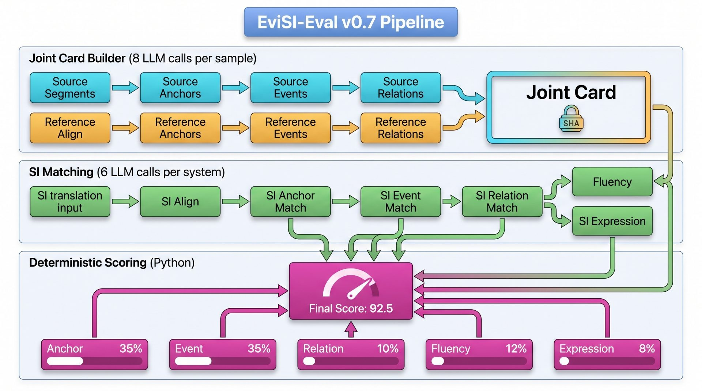
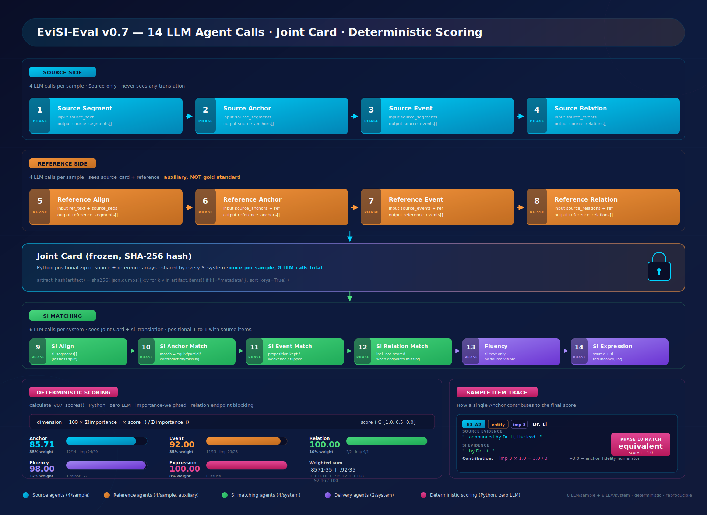

# EviSI-Eval Agent

> **Evidence-driven Simultaneous Interpretation Quality Evaluation System**

[](docs/)
[](pyproject.toml)
[](https://www.python.org/downloads/)
[](tests/)
[](LICENSE)
[](https://platform.deepseek.com/)
[](https://github.com/caiqiezujian/EviSI-Eval/stargazers)
[](https://github.com/caiqiezujian/EviSI-Eval/network/members)

<p align="center">
  
</p>

<p align="center">
  <sub><b>上段</b>：Source + Reference 联合抽取（8 LLM calls / sample，Joint Card SHA-256 冻结） · <b>中段</b>：每 SI 系统的位置匹配（6 LLM calls / system） · <b>下段</b>：确定性五维评分（Anchor 35% · Event 35% · Relation 10% · Fluency 12% · SI Expression 8%）</sub>
</p>

### 14 LLM Agent 详细调用链 + 评分计算全景

<p align="center">
  
</p>

<p align="center">
  <sub>每张卡 = 一次 LLM 调用（带 input/output schema） · Joint Card 冻结后所有 SI 系统共享 · 评分完全 Python 端确定性计算 · 右侧 Sample Item Trace 展示一个 Anchor 的 match 判定如何贡献到最终分数</sub>
</p>

---

## 评估范围

本项目评估**源语转录对应的最终同传文本**质量。不评估音频质量、ASR、首词延迟、平均滞后、增量字幕稳定性或语音播报质量。

## v0.7 核心思想

**Source 是唯一的事实权威。Reference 是辅助，不是参考答案。SI 的评分只看它是否忠实地把 Source 的内容传递出来。**

v0.7 采用 **联合抽取 + 位置匹配** 协议：Source 和 Reference 一同抽取，Python 代码按位置 zip 成 Joint Card（8 次 LLM 调用）。Joint Card 冻结后，每个 SI 系统按位置逐项匹配（6 次 LLM 调用），最后确定性计分。

```
源文 ──▶ Source 抽取 (Seg / Anchor / Event / Relation)
  │
  ├──▶ Reference 抽取 (Align / Anchor / Event / Relation)  ← 同一次 LLM 调用批次
  │         │
  │         └──▶ Joint Card (Python zip, SHA-256 冻结)
  │                    │
  └────────────────────┤
                       ▼
              SI 位置匹配 (Align / Anchor / Event / Relation) + Fluency + Expression
                       │
                       ▼
                 确定性评分
```

```bash
# 快速开始
python -m evisi_eval run \
  --samples data/user_samples.jsonl \
  --outputs data/user_system_outputs.jsonl \
  --provider deepseek \
  --output-dir results \
  --run-name my_run \
  --limit-samples 1 --limit-outputs 1

# 断点续跑
python -m evisi_eval run ... --resume
```

## 核心设计原则

| 原则 | 说明 |
|:---|:---|
| **Source 事实权威** | Joint Card 一旦冻结，所有后续判断都以其为基准，不可篡改 |
| **联合抽取** | Source + Reference 一同抽取，语义空间对齐后再冻结 |
| **位置匹配** | 数组按索引对齐 (source[i] ↔ reference[i] ↔ si[i])，不依赖 ID 交叉引用 |
| **Reference 辅助而非标准** | Reference 只辅助 SI 的匹配判断，不作为"正确答案"评分 |
| **哈希溯源** | Joint Card 含 SHA-256 哈希，断点续跑时校验一致性 |
| **确定性计分** | 所有评分基于 match 值（equivalent / partial / contradiction / missing）按公开规则计算，不依赖 LLM 的二次判断 |
| **自包含 Prompt** | 所有 prompt 文件独立完整，无需运行时协议注入 |

## v0.6 → v0.7 关键变化

| 维度 | v0.6 | v0.7 |
|:---|:---|:---|
| Reference 角色 | 被动投影到 Source items | 与 Source 一同抽取，作为辅助 |
| Joint Card | 无 | Source + Reference 按位置 zip + SHA-256 冻结 |
| 匹配方式 | Primary → Reviewer → Adjudicator 三模型 | 单次 LLM 逐项位置匹配 |
| 协议注入 | 支持 | 全部 prompt 自包含，无注入 |
| JSON 结构 | 嵌套（`component_results` / `hard_requirement`） | 扁平数组 |
| 阶段数 | 16 | 14（聚焦 12 阶段缓存 + 2 阶段直调） |
| 计分模型 | LLM 判定 + 代码加权 | **完全代码端确定性计分**（LLM 不再参与计分） |

> 在完成人工标注与一致性检验前，不应宣称评分已达绝对客观或成为成熟 benchmark。

## 流水线架构 (14 phases)

```
源文
  │
  ├── Phase 1  Source Segment     ──▶ source_segments
  ├── Phase 2  Source Anchor      ──▶ source_anchors
  ├── Phase 3  Source Event       ──▶ source_events
  ├── Phase 4  Source Relation    ──▶ source_relations
  │
  ├── Phase 5  Reference Align    ──▶ reference_segments
  ├── Phase 6  Reference Anchor   ──▶ reference_anchors
  ├── Phase 7  Reference Event    ──▶ reference_events
  ├── Phase 8  Reference Relation ──▶ reference_relations
  │                                    │
  │                          ☑ Joint Card (Python zip) 冻结
  │
Per SI system ─────────────────────────┘
  ├── Phase 9  SI Align            ──▶ si_segments
  ├── Phase 10 SI Anchor Match     ──▶ anchor_matches
  ├── Phase 11 SI Event Match      ──▶ event_matches
  ├── Phase 12 SI Relation Match   ──▶ relation_matches
  ├── Phase 13 Fluency             ──▶ fluency issues
  ├── Phase 14 SI Expression       ──▶ expression issues
  │
  └── Python 确定性评分
```

## Agent 职责表

| Agent | 职责 | 信息边界 |
|:---|:---|:---|
| `V07JointCardBuilder` | Source 抽取 + Reference 抽取 + Python zip 冻结 | Source 仅看源文，Reference 看源文+译文 |
| `V07SIMatcher` | SI 位置对齐 + Anchor/Event/Relation 匹配 + Delivery | Joint Card + SI 译文 |
| `FluencyAgent` | 评估目标语通顺度 | **仅 SI 译文** |
| `SIExpressionAgent` | 评估同传特有表达问题 | Source + SI 译文 |

**注意：** v0.7 没有独立的 Judge Agent、Reviewer Agent、Adjudicator Agent——评分直接在 `calculate_v07_scores()` 中通过匹配结果确定。

## 五维评分体系

| 维度 | 权重 | 测量对象 | 证据来源 |
|:---|---:|:---|:---|
| **Anchor Fidelity** | 35% | 实体、数字、单位、时间、术语、范围 | `anchor_matches[i].match` |
| **Event Fidelity** | 35% | 主体、动作/状态、对象、方向、否定、情态 | `event_matches[i].match` |
| **Relation Fidelity** | 10% | 因果、条件、转折、时序、比较等关系 | `relation_matches[i].match`（跳过 `not_scored` 项） |
| **Fluency** | 12% | 目标语言本身的通顺度与可理解性 | `fluency_issues[*].severity` 扣除 |
| **SI Expression** | 8% | 同传表达的效率、冗余和组织负担 | `si_expression_issues[*].severity` 扣除 |

- Source 侧 items 按 `importance: 1 / 2 / 3` 加权
- Match 值映射：`equivalent=1.0`, `partial=0.5`, `contradiction / missing=0.0`
- `uncertain` / `not_scored` 项从分母中排除
- Relation 端点事件 missing/uncertain 时，该 relation 标记 `not_scored`，不参与计算

## 快速开始

### 1. 安装

```bash
# 创建环境（推荐 Conda）
conda create -n evisi-eval python=3.12 pip -y
conda activate evisi-eval

# 安装依赖
pip install -e ".[dev,llm]"
```

### 2. 配置模型

```powershell
# 设置用户级环境变量
[Environment]::SetEnvironmentVariable("DEEPSEEK_API_KEY", "your-api-key", "User")
[Environment]::SetEnvironmentVariable("DEEPSEEK_MODEL", "deepseek-v4-flash", "User")

# 验证连接
python -m evisi_eval check-provider --provider deepseek
# ✅ 连接成功：provider=deepseek model=deepseek-v4-flash
```

> 也可复制 `local_secrets.py.example` 为 `local_secrets.py` 后填写（已被 `.gitignore` 忽略）。
> 支持 `deepseek`、`openai`、`gemini`、`custom` 四种 provider。

### 3. 运行评测

```bash
# 先校验输入格式
python -m evisi_eval check-input \
  --samples data/user_samples.jsonl \
  --outputs data/user_system_outputs.jsonl

# 运行 v0.7 流水线
python -m evisi_eval run \
  --samples data/user_samples.jsonl \
  --outputs data/user_system_outputs.jsonl \
  --provider deepseek \
  --output-dir results \
  --run-name my_run \
  --limit-samples 1 --limit-outputs 1
```

**断点续跑：** `--resume`（prompt、输入或模型哈希改变后需使用新的 `--run-name`）

## 输入格式

**样本文件**（每行一个源文）：

```json
{"sample_id":"sample_001","source_text":"...","reference_translation":"...","src_lang":"en","tgt_lang":"zh","domain":"general"}
```

**系统输出文件**（每个系统一行）：

```json
{"sample_id":"sample_001","system_name":"system_a","si_translation":"最终同传译文"}
```

- `transcript` / `offline_translation` 可分别作为 `source_text` / `reference_translation` 的兼容别名
- `system_asr` 被忽略
- 同一 `sample_id` 可对应多个系统输出

## 输出结构

```
results/<run-name>/
├── joint/
│   ├── source_00_input.jsonl
│   ├── joint_cards_v07.jsonl              # 冻结联合卡
│   └── stages/<sample_id>/                # 各阶段缓存 (Phase 1-8)
├── target/
│   ├── target_00_input.jsonl
│   ├── si_cards_v07.jsonl                 # SI 匹配卡
│   └── stages/<sample_id>/<system>/       # 各阶段缓存 (Phase 9-14)
├── score/
│   └── final_results_v07.jsonl            # 逐项诊断与确定性分数
├── failures.jsonl                         # ⚠️ 先查这个
├── metrics_v07.json
└── run_manifest_v07.json                  # 完整哈希链（可复现）
```

**检查顺序：** `failures.jsonl` → `score/final_results_v07.jsonl` → `metrics_v07.json`

## 本地测试

```bash
python -m pytest -q
# 使用 ScriptedLLMClient，无需 API Key
```

## 协议演进

```
v0.3  ────▶  v0.5  ────▶  v0.6  ────▶  v0.7 (当前)
早期抽取       双Agent复核     源条件投影      联合抽取 + 位置匹配
```

详见 [CHANGELOG.md](CHANGELOG.md)。

## 当前限制与下一步

| 状态 | 任务 |
|:---:|:---|
| ✅ 已完成 | Source+Reference 联合抽取、位置匹配与哈希溯源（v0.7.0） |
| 🔄 进行中 | 人工标注集构建（数字、实体、否定、情态、关系、同传压缩） |
| 📋 待做 | 双人标注与仲裁流程，项目级一致性（Krippendorff's α） |
| 📋 待做 | 不同模型、Prompt 版本与多次运行的稳定性分析 |
| 📋 待做 | Benchmark 版本固化、模型快照与发布报告 |

## 文档

| 文档 | 说明 |
|:---|:---|
| [**v0.7 协议设计**](docs/v0.7_protocol_design.md) | 完整设计：14 阶段 / 信息隔离 / 确定性评分 / 约束清单（**推荐**） |
| [v0.7 设计草稿](docs/v0.7_design/00_architecture.md) | v0.7 设计过程记录（已被 v0.7 协议设计取代） |
| [架构文档](docs/architecture.md) | v0.5 架构（已过时，仅供历史参考） |
| [数据契约](docs/data_contract.md) | 各 artifact 的 schema 与验证规则 |
| [评分协议](docs/scoring_protocol.md) | 五维评分算法与 provisional 处理 |
| [操作指南](docs/operation_guide.md) | 完整 CLI 手册与数据准备流程 |

## Star History

[](https://star-history.com/#caiqiezujian/EviSI-Eval&Date)

---

<p align="center">
  
  
  
  
</p>
