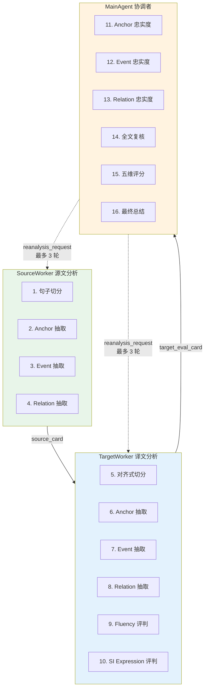

<div align="center">

# EviSI-Eval Agent

### 证据驱动的同声传译最终译文质量评估 Agent

[](CHANGELOG.md)
[](pyproject.toml)
[](#协议)
[](tests/)
[](LICENSE)
[](#)

*EviSI-Eval = Evidence-driven Simultaneous Interpretation Evaluation*

[**快速开始**](#-快速开始) · [**协议**](#-协议) · [**架构**](#-架构) · [**文档**](#-文档)

</div>

---

## 这是什么

EviSI-Eval 是一个 **LLM 驱动的同声传译质量评估 Agent**。它接收一段源语转录和一个同传系统的最终译文，给出**带证据的五维评分**。

**核心问题**：听众通过这段同传译文，是否获得了与源文一致、足够完整、清楚自然、符合同传表达特点的信息？

**当前实现遵循 `evisi_eval_v0.4` 协议**。系统只评估**最终文本**，不评估真实延迟、partial 输出、字幕稳定性、音频质量、系统 ASR 或语音播报。

---

## 为什么 v0.4 是一次质的升级

v0.3 是 16 个 stage 轮流调用的"伪 agent"。**v0.4 是真·agent 架构**——3 个独立 agent 协作，MainAgent 还能**主动要求 worker 重新分析**。

| 痛点 | v0.3 表现 | v0.4 解法 |
|---|---|---|
| **没有 agent 概念** | 16 个 stage + 固定 workflow | 3 个真·agent 协作 |
| **无法回头** | LLM 抽取错了只能 salvage 兜底 | **Reanalysis loop**：MainAgent 可要求 worker 带着 `focus` 重做 |
| **抽取 vs 判断混淆** | anchor prompt 提到"动作交给 event" | Agent 视角纯净：worker 只看自己侧，judge 只看结构化结果 |
| **信息隔离靠 prompt** | 写"不要看另一侧"是软约束 | **代码层强制**：TargetWorker 物理拿不到 source_anchors |

---

## 协议

### 3-Agent 架构



### 信息隔离（代码层强制）

| Agent | 看到 | 看不到 |
|---|---|---|
| **SourceWorker** | `source_text` + `reference_translation` × | 任何译文 |
| **TargetWorker** | `si_translation` + `source_units`（仅 id+text） | 源文 anchor/event/relation 抽取结果 |
| **MainAgent** | `source_card` + `target_eval_card`（结构化） | 原始 `source_text` / `si_translation` |

### Reanalysis Loop

MainAgent 看完结构化结果后，可以**要求 worker 带着 `focus` 重新分析**：

```json
{
  "reanalysis_request": {
    "target": "source_worker | target_worker",
    "reason": "SourceWorker 明显遗漏了关键数字 anchor",
    "focus": "S3, S5",
    "instructions": "重点抽取这两个 unit 中的金额和日期"
  }
}
```

最多 3 轮，强制终止。这是 v0.4 比 v0.3 更**健壮**的关键。

### 5 维评分

| 维度 | 权重 | 关注什么 |
|---|:---:|---|
| **Anchor Fidelity** | 30% | 关键信息锚点（人名、数字、时间、术语等）是否准确传达 |
| **Event Fidelity** | 25% | 核心事件语义（谁做了什么、什么变化、什么判断）是否保留 |
| **Relation Fidelity** | 20% | 逻辑关系（因果、转折、时序、比较等）是否保留 |
| **Fluency** | 15% | 完整译文作为目标语是否清楚自然可理解 |
| **SI Expression** | 10% | 是否符合同传表达要求（简洁、顺畅、无重复堆叠） |

总分 = `anchor_fidelity × 0.30 + event_fidelity × 0.25 + relation_fidelity × 0.20 + fluency × 0.15 + si_expression × 0.10`

### 5 档判定

每个 anchor / event / relation 都被判定为：

| Verdict | 含义 |
|---|---|
| `correct` | 准确表达 |
| `partially_correct` | 部分信息但不完整 |
| `incorrect` | 错误的对象/数字/方向 |
| `missing` | 找不到任何对应表达 |
| `uncertain` | 证据不足或存在多种合理解释 |

> 注：relation 维度把 `partially_correct` 替换为 `weakened`（关系被弱化但仍可理解）。

---

## 🚀 快速开始

### 安装

```bash
git clone https://github.com/caiqiezujian/EviSI-Eval.git
cd EviSI-Eval
pip install -e ".[dev,llm]"
```

### 配置 LLM

支持 DeepSeek / OpenAI / Gemini / 自定义 OpenAI 兼容服务。

**方式一：环境变量**
```bash
export DEEPSEEK_API_KEY="your-key"
export DEEPSEEK_MODEL="deepseek-v4-flash"
```

**方式二：本地密钥文件**
```bash
cp local_secrets.py.example local_secrets.py
# 编辑填写 DEEPSEEK_API_KEY / DEEPSEEK_MODEL
```

**验证连接**
```bash
python -m evisi_eval check-provider --provider deepseek
```

### 准备数据

```bash
python -m evisi_eval prepare-data \
  --samples data/user_samples.jsonl \
  --outputs data/user_system_outputs.jsonl \
  --output-dir data/user_samples_v03
```

会生成完整数据 + 逐样本目录 + 一条 smoke 数据。

### 运行评测

```bash
# 先跑 smoke（1 个样本）做端到端验证
python -m evisi_eval run \
  --samples data/user_samples_v03/smoke/source_00_input.jsonl \
  --outputs data/user_samples_v03/smoke/target_00_input.jsonl \
  --provider deepseek \
  --run-name user_smoke_v04

# 跑完整数据
python -m evisi_eval run \
  --samples data/user_samples_v03/source_00_input.jsonl \
  --outputs data/user_samples_v03/target_00_input.jsonl \
  --provider deepseek \
  --run-name user_full_v04
```

可选参数：`--sample-id`、`--system-name`、`--limit-samples`、`--limit-outputs`、`--resume`（断点续跑）。

### 导入宽表格式

如果你手头是"宽表"格式（一个样本多系统译文在同一行）：

```bash
python -m evisi_eval import-data \
  --input data/raw_zh.json data/raw_en.json \
  --samples-output data/samples.jsonl \
  --outputs-output data/outputs.jsonl
```

---

## 📂 输入数据格式

### 源文 JSONL

```json
{"sample_id": "sample_001", "source_text": "...", "reference_translation": "可选", "src_lang": "en", "tgt_lang": "zh", "domain": "tech"}
```

### 系统译文 JSONL

```json
{"sample_id": "sample_001", "system_name": "system_a", "si_translation": "最终同传译文"}
```

每个系统一行；多系统共享 `sample_id`，由 `system_name` 区分。

---

## 📁 输出结构（v0.4 简化版）

v0.4 把 v0.3 的 16 个 JSONL 合并为 3 个核心 card，**评估中间证据更聚焦**：

```text
results/user_full_v04/
├── source/
│   ├── source_00_input.jsonl        # 输入
│   └── source_cards.jsonl            # SourceWorker 输出（含 units/anchors/events/relations）
├── target/
│   ├── target_00_input.jsonl
│   └── target_eval_cards.jsonl       # TargetWorker 输出（含 eval_units + 6 个 task 结果）
├── score/
│   └── score_06_final_results.jsonl  # MainAgent 输出（judgements + scores + summary）
├── agent_trace.jsonl                 # 完整 LLM 调用 trace（用于审计）
├── metrics.json                      # 聚合指标
├── run_manifest.json                 # 运行配置快照
├── failures.jsonl                    # 失败样本清单
└── report.html                       # 可视化报告
```

每个 card 内部都包含**完整的源文/译文分析结果**——这是 v0.4 的关键改进：judge 不用跨越多个文件拼装数据。

---

## 🛠️ 开发

```bash
# 运行测试（18 个测试，0.3s via ScriptedLLMClient — 无需 API key）
python -m pytest -q

# 查看 CLI 帮助
python -m evisi_eval --help
python -m evisi_eval run --help
```

### 项目结构

```text
EviSI-Eval/
├── evisi_eval/                  # 核心 Python 包
│   ├── agents.py                # 3 个 Agent + AgentLoop（v0.4 核心）
│   ├── pipeline.py              # 顶层 pipeline / 断点续跑
│   ├── validation.py            # 结构校验（不判断语义）
│   ├── llm_provider.py          # HTTP + Scripted (测试用) LLM client
│   ├── prompt_loader.py         # 4 个 prompt 加载 + hash
│   ├── config.py                # Provider 配置（env / local_secrets）
│   ├── dataset.py               # 数据准备 + 拆分 + smoke
│   ├── importers.py             # 宽表 → 长表
│   ├── report.py                # HTML 报告
│   ├── cli.py                   # CLI 入口
│   └── io_utils.py              # JSONL / JSON I/O
├── prompts/                     # 4 个 prompt 模板（md）
│   ├── source_worker.md         # 源文分析专家
│   ├── target_worker.md         # 译文分析专家
│   ├── main_agent.md            # 评估协调者
│   ├── schema_repair.md         # 失败修复（跨 agent 共享）
│   └── legacy/                  # v0.3 16 个 prompt（已弃用，保留做参考）
├── schemas/                     # 3 个 JSON Schema
│   ├── source_card.schema.json
│   ├── target_eval_card.schema.json
│   └── final_result.schema.json
├── data/                        # 标准化样本
│   └── user_samples_v03/
├── docs/                        # 协议与文档
│   ├── requirements-v0.1.md     # 早期需求
│   ├── requirements-v0.3.md     # v0.3 协议
│   ├── architecture.md
│   ├── data_contract.md
│   ├── operation_guide.md
│   ├── prompt-set-v0.3.md
│   └── scoring_protocol.md
├── tests/                       # 18 个测试
│   ├── test_agents.py           # 8 个 agent 行为测试
│   ├── test_pipeline.py         # 集成测试
│   ├── test_prompt_contracts.py # Prompt 关键词契约
│   ├── test_protocol_v03.py     # v0.3 schema 兼容
│   ├── test_dataset.py
│   └── test_importers.py
├── results/                     # 评测输出
├── reports/                     # HTML 报告
├── CLAUDE.md                    # Claude Code 指南
├── CHANGELOG.md
└── pyproject.toml
```

---

## 🧪 测试覆盖

18 个测试，0.3 秒跑完：

| 测试文件 | 数量 | 覆盖 |
|---|---:|---|
| `test_agents.py` | 8 | **3 个 agent 行为 + 4 个隔离原则 + reanalysis flow** |
| `test_pipeline.py` | 1 | 端到端 pipeline 集成 |
| `test_prompt_contracts.py` | 4 | Prompt 关键词契约（isolation / 评分约束） |
| `test_protocol_v03.py` | 2 | v0.3 schema 兼容 |
| `test_dataset.py` | 1 | 数据准备 |
| `test_importers.py` | 2 | 宽表导入 |

`test_agents.py` 重点测的 4 个隔离原则：
- `test_system_name_isolation` — 真实系统名不进 LLM payload
- `test_reference_translation_isolation` — 参考译文不进 LLM payload
- `test_source_worker_sees_only_source` — SourceWorker 拿不到译文
- `test_target_worker_sees_no_source_analysis` — TargetWorker 拿不到源文分析
- `test_main_agent_sees_no_raw_text` — MainAgent 拿不到原文/译文

---

## 📚 文档

按"先协议，后使用，再开发"的顺序：

1. [**协议 v0.1**](docs/requirements-v0.1.md) — 早期需求与方案
2. [**协议 v0.3**](docs/requirements-v0.3.md) — 上一版协议（16 stage）
3. [**架构**](docs/architecture.md) — 数据流与模块依赖
4. [**数据契约**](docs/data_contract.md) — 所有 JSONL 字段定义
5. [**Prompt 集 v0.3**](docs/prompt-set-v0.3.md) — 16 个老 prompt（参考用）
6. [**评分协议**](docs/scoring_protocol.md) — 5 维评分细则
7. [**操作指南**](docs/operation_guide.md) — 跑通端到端流程

> 注：v0.4 的 3 个 prompt（`source_worker` / `target_worker` / `main_agent`）在 `prompts/` 目录下。

---

## 🗺️ Roadmap

- [x] **v0.1** — 协议与方案设计
- [x] **v0.3** — 16 阶段协议重构，5 维评分，源/译分离
- [x] **v0.4** — 3 真·agent 架构 + Reanalysis loop
- [ ] **v0.5** — 并发评测、jsonschema 落地校验、TypedDict
- [ ] **v0.6** — 与人工评估的 calibration 工具
- [ ] **v0.7** — 多系统对比可视化、跨样本 anchor/event 统计

完整变更见 [CHANGELOG.md](CHANGELOG.md)。

---

## 🤝 贡献

欢迎提 issue / PR 改进协议或代码。当前 v0.4 还在 active development，特别欢迎：

- 📝 协议设计讨论（3-agent 边界、reanalysis 策略）
- 🐛 测试用例补充（特别是 reanalysis 触发边界 case）
- 🌐 多语言 Prompt 适配
- 📊 与人工评估的对比数据

---

## 📄 License

[MIT](LICENSE)

---

<div align="center">

**EviSI-Eval** · 证据驱动的同传评估 · 2026

</div>
