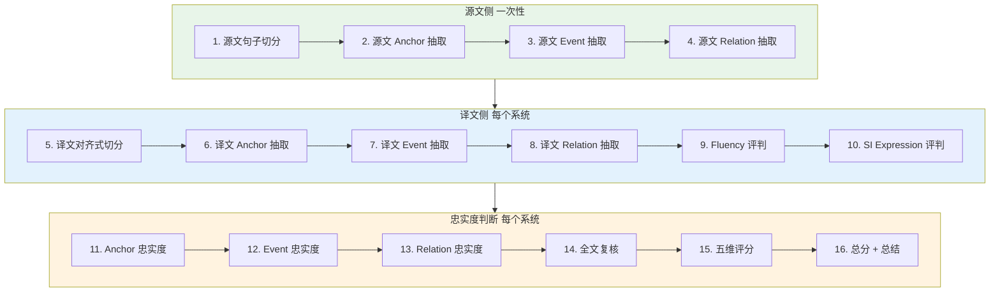

<div align="center">

# EviSI-Eval Agent

### 证据驱动的同声传译最终译文质量评估 Agent

[](CHANGELOG.md)
[](pyproject.toml)
[](#协议)
[](LICENSE)
[](#)

*EviSI-Eval = Evidence-driven Simultaneous Interpretation Evaluation*

[**快速开始**](#-快速开始) · [**协议**](#-协议) · [**文档**](#-文档) · [**English**](docs/architecture.md)

</div>

---

## 这是什么

EviSI-Eval 是一个 **LLM 驱动的同声传译质量评估 Agent**。它接收一段源语转录和一个同传系统的最终译文，给出**带证据的五维评分**。

**核心问题**：听众通过这段同传译文，是否获得了与源文一致、足够完整、清楚自然、符合同传表达特点的信息？

**当前实现遵循 `evisi_eval_v0.3` 协议**。系统只评估**最终文本**，不评估真实延迟、partial 输出、字幕稳定性、音频质量、系统 ASR 或语音播报。

---

## 为什么需要它

传统 SI 评估存在三个根本问题：

| 痛点 | 表现 | EviSI-Eval 的解法 |
|---|---|---|
| **黑箱打分** | LLM 直接看原文+译文给总分，无法审查 | 16 阶段链式流程 + 每步留 JSONL 中间证据 |
| **粒度坍缩** | 漏一个数字和错一段话，可能拿到同一个扣分 | 拆为 anchor / event / relation / fluency / SI expression 5 维 |
| **脑补补全** | LLM 看了一侧会"帮"另一侧补内容 | **单侧独立抽取** + **系统名匿名** + **参考译文隔离** |

---

## 协议

EviSI-Eval 不是一个模型，而是一个**评估协议 (Protocol)**。它把评估任务拆成 16 个有明确输入输出的阶段：



### 5 维评分

| 维度 | 权重 | 关注什么 |
|---|:---:|---|
| **Anchor Fidelity** | 30% | 关键信息锚点（人名、数字、时间、术语等）是否准确传达 |
| **Event Fidelity** | 25% | 核心事件语义（谁做了什么、什么变化、什么判断）是否保留 |
| **Relation Fidelity** | 20% | 逻辑关系（因果、转折、时序、比较等）是否保留 |
| **Fluency** | 15% | 完整译文作为目标语是否清楚自然可理解 |
| **SI Expression** | 10% | 是否符合同传表达要求（简洁、顺畅、无重复堆叠） |

总分 = `anchor_fidelity × 0.30 + event_fidelity × 0.25 + relation_fidelity × 0.20 + fluency × 0.15 + si_expression × 0.10`

### 5 档判定

每个 anchor / event / relation 都会被判定为：

| Verdict | 含义 |
|---|---|
| `correct` | 准确表达 |
| `partially_correct` | 部分信息但不完整 |
| `incorrect` | 错误的对象/数字/方向 |
| `missing` | 找不到任何对应表达 |
| `uncertain` | 证据不足或存在多种合理解释 |

> 注：relation 维度把 `partially_correct` 替换为 `weakened`（关系被弱化但仍可理解）。

### 关键设计约束

- 🛡️ **单侧独立抽取**：抽源文 anchor 时物理上看不到任何译文
- 🔒 **参考译文隔离**：reference_translation 只在输入和报告中，不传入核心评测阶段
- 🎭 **系统名匿名**：LLM 看到的是 `anonymous_system`，不带偏见
- 📐 **无损切分**：切分后 source/target 拼接必须严格等于原文/译文
- 📝 **逐字证据**：每个 anchor/event/relation/issue 都要求 `evidence_span` 在原文中存在
- 🚫 **评分不能新增错误**：Step 15 只能消费前 14 步的结构化结果

---

## 🚀 快速开始

### 安装

```bash
git clone https://github.com/caiqiezujian/EviSI-Eval.git
cd EviSI-Eval
pip install -e .
```

### 配置 LLM

支持 DeepSeek / OpenAI / Gemini / 自定义 OpenAI 兼容服务。

**方式一：环境变量**
```bash
export DEEPSEEK_API_KEY="your-key"
export DEEPSEEK_MODEL="deepseek-chat"
```

**方式二：本地密钥文件**
```bash
cp local_secrets.py.example local_secrets.py
# 编辑填写 DEEPSEEK_API_KEY / DEEPSEEK_MODEL
```

**验证连接**
```bash
python -m evisi_eval check-provider --provider deepseek
```

### 准备数据

```bash
python -m evisi_eval prepare-data \
  --samples data/user_samples.jsonl \
  --outputs data/user_system_outputs.jsonl \
  --output-dir data/user_samples_v03
```

会生成完整数据 + 逐样本目录 + 一条 smoke 数据。

### 运行评测

```bash
# 先跑 smoke（1 个样本）做端到端验证
python -m evisi_eval run \
  --samples data/user_samples_v03/smoke/source_00_input.jsonl \
  --outputs data/user_samples_v03/smoke/target_00_input.jsonl \
  --provider deepseek \
  --run-name user_smoke_v03

# 跑完整数据
python -m evisi_eval run \
  --samples data/user_samples_v03/source_00_input.jsonl \
  --outputs data/user_samples_v03/target_00_input.jsonl \
  --provider deepseek \
  --run-name user_full_v03
```

可选参数：`--sample-id`、`--system-name`、`--limit-samples`、`--limit-outputs`、`--resume`（断点续跑）。

### 导入宽表格式

如果你手头是"宽表"格式（一个样本一多系统译文在同一行）：

```bash
python -m evisi_eval import-data \
  --input data/raw_zh.json data/raw_en.json \
  --samples-output data/samples.jsonl \
  --outputs-output data/outputs.jsonl
```

---

## 📂 输入数据格式

### 源文 JSONL

```json
{"sample_id": "sample_001", "source_text": "...", "reference_translation": "可选", "src_lang": "en", "tgt_lang": "zh", "domain": "tech"}
```

### 系统译文 JSONL

```json
{"sample_id": "sample_001", "system_name": "system_a", "si_translation": "最终同传译文"}
```

每个系统一行；多系统共享 `sample_id`，由 `system_name` 区分。

---

## 📁 输出结构

每次运行在 `results/<run-name>/` 下生成完整证据链：

```text
results/user_full_v03/
├── source/                       # 源文侧一次性抽取
│   ├── source_00_input.jsonl
│   ├── source_01_units.jsonl
│   ├── source_02_anchors.jsonl
│   ├── source_03_events.jsonl
│   ├── source_04_relations.jsonl
│   └── source_cards.jsonl
├── target/                       # 每个系统独立抽取
│   ├── target_00_input.jsonl
│   ├── target_01_eval_units.jsonl
│   ├── target_02_anchors.jsonl
│   ├── target_03_events.jsonl
│   ├── target_04_relations.jsonl
│   ├── target_05_fluency.jsonl
│   ├── target_06_si_expression.jsonl
│   └── target_eval_cards.jsonl
├── score/                        # 忠实度判断 + 评分
│   ├── score_01_anchor_judgements.jsonl
│   ├── score_02_event_judgements.jsonl
│   ├── score_03_relation_judgements.jsonl
│   ├── score_04_global_review.jsonl
│   ├── score_05_dimension_scores.jsonl
│   └── score_06_final_results.jsonl
├── metrics.json                  # 聚合指标
├── run_manifest.json             # 运行配置快照
├── failures.jsonl                # 失败样本清单
└── report.html                   # 可视化报告
```

每一行都是**完整 sample × system 的全部中间状态**，方便断点续跑、人工审查和错误定位。

---

## 🛠️ 开发

```bash
# 运行测试（8 个测试，0.15s）
python -m pytest -q

# 查看 CLI 帮助
python -m evisi_eval --help
python -m evisi_eval run --help
```

### 项目结构

```text
EviSI-Eval/
├── evisi_eval/                  # 核心 Python 包
│   ├── agent.py                 # StageRunner + 16 阶段编排
│   ├── pipeline.py              # 顶层 pipeline / 断点续跑
│   ├── validation.py            # 结构校验（不判断语义）
│   ├── llm_provider.py          # HTTP + Scripted (测试用) LLM client
│   ├── prompt_loader.py         # Prompt 模板加载 + hash
│   ├── config.py                # Provider 配置（env / local_secrets）
│   ├── dataset.py               # 数据准备 + 拆分 + smoke
│   ├── importers.py             # 宽表 → 长表
│   ├── report.py                # HTML 报告
│   ├── cli.py                   # CLI 入口
│   └── io_utils.py              # JSONL / JSON I/O
├── prompts/                     # 17 个 prompt 模板（md）
│   ├── source_*_prompt.md       # 源文侧 4 个
│   ├── target_*_prompt.md       # 译文侧 4 个
│   ├── *_judgement_prompt.md    # 3 个忠实度判断
│   ├── *_evaluation_prompt.md   # 2 个表达评判
│   ├── dimension_scoring_prompt.md
│   ├── final_summary_prompt.md
│   ├── global_fidelity_review_prompt.md
│   └── schema_repair.md         # 失败修复
├── schemas/                     # 3 个 JSON Schema
│   ├── source_card.schema.json
│   ├── target_eval_card.schema.json
│   └── final_result.schema.json
├── data/                        # 标准化样本
│   └── user_samples_v03/
├── docs/                        # 协议与文档
│   ├── requirements-v0.1.md     # 早期需求
│   ├── requirements-v0.3.md     # 当前协议
│   ├── architecture.md
│   ├── data_contract.md
│   ├── operation_guide.md
│   ├── prompt-set-v0.3.md
│   └── scoring_protocol.md
├── tests/                       # 8 个测试
├── results/                     # 评测输出
├── reports/                     # HTML 报告
└── pyproject.toml
```

---

## 📚 文档

按"先协议，后使用，再开发"的顺序：

1. [**协议 v0.1**](docs/requirements-v0.1.md) — 早期需求与方案
2. [**协议 v0.3**](docs/requirements-v0.3.md) — 当前实现协议（推荐先读）
3. [**架构**](docs/architecture.md) — 数据流与模块依赖
4. [**数据契约**](docs/data_contract.md) — 所有 JSONL 字段定义
5. [**Prompt 集**](docs/prompt-set-v0.3.md) — 17 个 prompt 完整内容
6. [**评分协议**](docs/scoring_protocol.md) — 5 维评分细则
7. [**操作指南**](docs/operation_guide.md) — 跑通端到端流程

---

## 🗺️ Roadmap

- [x] **v0.1** — 协议与方案设计
- [x] **v0.3** — 16 阶段协议重构，5 维评分，源/译分离
- [ ] **v0.4** — 并发评测、jsonschema 落地校验、TypedDict
- [ ] **v0.5** — importance 字段回填、多系统评测可视化
- [ ] **v0.6** — 与人工评估的 calibration 工具

完整变更见 [CHANGELOG.md](CHANGELOG.md)。

---

## 🤝 贡献

欢迎提 issue / PR 改进协议或代码。当前 v0.3 还在 prototype 阶段，特别欢迎：

- 📝 协议设计讨论（v0.1 plan 的 6 个待确认点）
- 🐛 测试用例补充（特别是边界 case）
- 🌐 多语言 Prompt 适配
- 📊 与人工评估的对比数据

---

## 📄 License

[MIT](LICENSE)

---

<div align="center">

**EviSI-Eval** · 证据驱动的同传评估 · 2026

</div>
