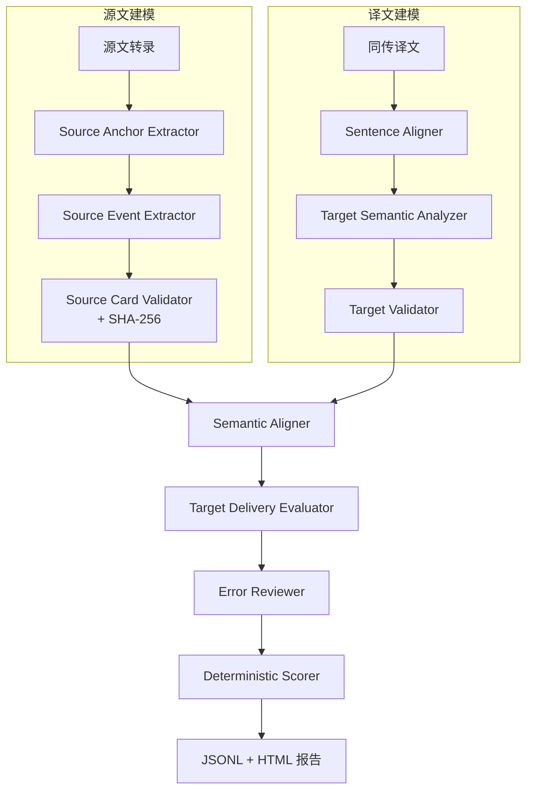

# 系统架构

## 1. 目标与边界

EviSI-Eval 评价同传系统的最终译文质量。核心问题不是计算表面字符串相似度，而是回答：听众是否从同传译文中获得了与源文一致的对象、数量、事件、参与者角色、边界条件和逻辑关系，同时译文是否可理解且没有明显冗余。

系统要求源语 `transcript`。离线译文可选，只提供目标语言表达参考。系统名称不会进入任何评测 Prompt，系统自己的 ASR 不参与当前轨道。

## 2. 设计原则

1. 源文权威：所有语义要求必须追溯到源文逐字证据。
2. 表示与评分分离：LLM 生成结构化分析和局部 verdict，Python 生成分数。
3. 定位与核验分离：句级对齐器先定位译文单元；目标分析器可使用源文清单提高召回，但每个目标项目必须由译文逐字证据独立支持。
4. 两级显式对齐：先建立源句—译文单元映射，再核验事实锚点、事件和关系。
5. 同传友好：允许压缩、合句、拆句、延迟表达和有限局部重排。
6. 证据约束：源文和译文证据跨度必须逐字存在于对应文本。
7. 错误单归因：同一语义损失只在一个维度扣分。
8. 失败关闭：结构化输出无法修复时记录失败，不用不完整结果生成看似精确的分数。

## 3. 数据流



文字版（与图等价，便于复制）：

```text
Sample
  -> Source Anchor Extractor
  -> Source Event Extractor
  -> Source Card Validator + SHA-256
  -> frozen Source Card

SI Translation
  -> LLM Sentence Segmenter and Source-Target Aligner
  -> Target Anchor / Event / Relation Analyzer
  -> Target Validator

Source Card + Target Analysis + Raw Translation
  -> Semantic Aligner
  -> Target Delivery Evaluator
  -> Error Reviewer
  -> Deterministic Scorer
  -> JSONL / Metrics / HTML Report
```

## 4. 源文建模

### 4.1 事实锚点

事实锚点覆盖人名、机构、地点、时间、数量、金额、产品、项目、命名事件和领域术语。锚点按句中出现位置建模，同一对象跨句重复时保留多个 occurrence。

数量不作为脱离上下文的裸值处理。`150,000 jobs` 应同时保留逐字跨度、规范化数值、单位和 referent，避免将另一处 `150,000` 错配为当前事实。

否定、情态、方向和范围不是实体，统一进入事件属性。这样可以避免同一处 `may not increase` 同时在事实层和事件层扣分。

### 4.2 最小事件

事件由中心谓词、参与者角色、关联锚点、边界属性和证据跨度组成。并列的独立动作应拆分；原因、条件、对比、归因等事件间链接进入 `relations`，不再复制成额外事件。

每个事件同时保留：

- `evidence_spans`：可确定性检查的源文逐字证据。
- `canonical_meaning`：便于跨语言核验的规范化语义。
- `predicate` 和 `arguments`：检查动作和参与者角色。
- `attributes`：检查 polarity、modality、direction、scope 和 tense/aspect。
- `linked_anchor_ids`：建立事件与事实锚点的依赖关系。

## 5. 译文建模与对齐

句级对齐器根据冻结源文分句切分同传译文，并为每个源句输出一条定位记录。记录允许 1:1、1:N、N:1、omitted 和 uncertain，不能机械假设 S1 对应 T1。目标分析器随后在冻结目标单元中生成目标锚点、目标事件和目标关系。源句只用于定位和召回，所有目标项目仍必须由译文逐字证据支持。该分析是索引，不是核验结论。

对齐器不得假定 `S1 -> T1`。它可以把一个源事件对齐到多个目标单元，也可以把多个源事件对齐到一个压缩目标单元。目标分析器漏掉候选项时，对齐器仍必须检查原始译文。

对齐输出必须为每个 required 源项目提供一个 verdict，并引用目标逐字证据。没有矛盾证据时，`incorrect` 与 `contradicted` 不应代替 `missing`；证据不足时使用 `ambiguous`。

## 6. 复核与确定性聚合

所有非正确 verdict 和目标语言问题进入错误复核。复核器只能通过译文逐字反证否定语义错误，离线译文不能充当反证。复核状态为 `valid`、`invalid` 或 `uncertain`。

只有高置信 `valid` 错误自动扣分。`uncertain` 项进入 `review_queue`，不自动扣分。最终聚合器按固定权重、重要性和 verdict 系数计算分数。

## 7. 扩展接口

当前 Source Card 可继续承载以下独立轨道：

- 音频质量：噪声、断音、说话人重叠。
- 流式性能：延迟、修订、稳定性、闪烁率。
- 领域专项：医疗、法律、金融中的高风险错误策略。
- 人工校准：冻结卡片、双人标注、仲裁和相关性分析。

这些轨道应新增输入和结果字段，不应从最终文本反推不可观测指标。
